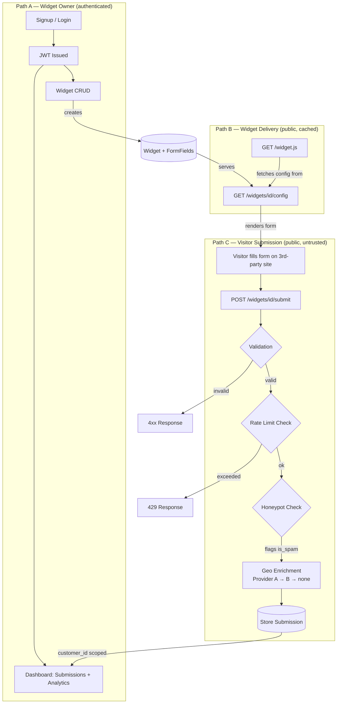

# flyrank-capstone-widgetplatform

Let a customer define a widget, hand them one line of &lt;script>, and safely catch everything the public internet throws back at you — validated, spam-filtered, enriched, and dashboarded.

## Overview

A multi-tenant platform where a business creates a widget (signup form, contact form, or CTA popover) and embeds it on any website with a single `<script>` tag. Visitor submissions are validated, rate-limited, spam-filtered, enriched with geolocation, and stored — then surfaced to the owner in a dashboard.

The engineering goal is resilience: a submission is never lost because a third-party geo provider or email service went down, and no tenant can ever reach another tenant's data. See the [PRD](docs/PRD.md) for the full scope and success criteria.

## Architecture Diagram



**Key principle:** each path has a distinct trust level, enforced separately.

- **Path A** — always authenticated, tenant-scoped via `customer_id` on every query.
- **Path B** — public but read-only, CORS-enabled, cache-optimized.
- **Path C** — public and write-capable — treated as fully untrusted input from the open internet.

---

**Resilience guarantee:** every failure branch in this diagram (rate limit, validation, both geo providers down) either rejects cleanly or degrades gracefully — none of them can crash the service, and enrichment failure specifically can never block storage (FR5.2).

---

### Tech stack

| Layer          | Choice                                |
| -------------- | ------------------------------------- |
| Language       | Python 3.12                           |
| Web framework  | FastAPI                               |
| Database       | PostgreSQL 16                         |
| ORM            | SQLAlchemy 2.0 (async) with `asyncpg` |
| Migrations     | Alembic (async template)              |
| Cache / limits | Redis 7 (`slowapi` + `limits`)        |
| Auth           | JWT (`PyJWT`) + bcrypt via `passlib`  |
| Config         | Pydantic `BaseSettings`               |
| Packaging      | uv                                    |
| Runtime        | Docker Compose                        |
| Tests          | pytest + pytest-asyncio               |

## Prerequisites

- [Docker Desktop](https://docs.docker.com/get-docker/) (running)
- [uv](https://docs.astral.sh/uv/getting-started/installation/) — only needed for host-side commands
- Python 3.12 — uv will fetch it if missing

## Installation

**1. Clone and enter the repo**

```bash
git clone <repository-url>
cd flyrank-capstone-widgetplatform
```

**2. Create your `.env`**

```bash
cp .env.example .env
```

Required before starting Docker — Compose reads `POSTGRES_USER`, `POSTGRES_PASSWORD`, and `POSTGRES_DB` from this file to provision the database and run its health check. Edit the password before doing anything non-local. `.env` is gitignored and must stay that way.

**3. Build and start**

```bash
docker compose up -d --build
```

The `app` container waits for Postgres to pass `pg_isready` before it starts, so the first request won't hit a database that is still initialising.

**4. Verify**

```bash
docker compose ps                          # db should read (healthy)
curl -s localhost:8000/api/v1/health       # {"status":"ok"}
curl -s localhost:8000/api/v1/db-check     # {"status":"ok","database":"connected"}
```

## Running tests

Inside the container (recommended — the database is already reachable):

```bash
docker compose exec app pytest -v
```

Tests run against a throwaway `<POSTGRES_DB>_test` database and Redis DB `REDIS_TEST_DB` (15), so a run never touches development data. Rate limit tests skip with a clear reason if Redis is unreachable rather than failing the suite.

Rate limiting is **disabled by default in tests** by an autouse fixture and enabled only inside the rate limit tests themselves. Without that, the shared per-IP counter would leak across tests — every test client shares one address, so the 40-plus login calls elsewhere in the suite would trip the limit and fail unrelated assertions.

## Testing the embeddable widget locally

To verify the widget loads and renders correctly on a different origin (required for CORS testing):

**1. Start the API server**

```bash
docker compose up -d
```

**2. Create a widget via the API**

```bash
# Sign up and get a token
curl -X POST http://localhost:8000/api/v1/auth/signup \
  -H "Content-Type: application/json" \
  -d '{
    "email": "test@example.com",
    "password": "TestPassword123!",
    "organization_name": "Test Org"
  }'

# Create a widget
curl -X POST http://localhost:8000/api/v1/widgets \
  -H "Authorization: Bearer YOUR_TOKEN" \
  -H "Content-Type: application/json" \
  -d '{
    "widget_type": "signup_form",
    "title": "Newsletter Signup",
    "description": "Join our mailing list",
    "button_text": "Subscribe",
    "theme_color": "#0066cc",
    "form_fields": [
      {
        "field_name": "email",
        "label": "Email Address",
        "field_type": "email",
        "is_required": true
      }
    ]
  }'
```

Copy the `embed_snippet` from the response (e.g., `<script src="http://localhost:8000/widget.js?id=YOUR_WIDGET_ID"></script>`).

**3. Serve the test page on a different port**

Open a new terminal and run:

```bash
cd test-page/
python -m http.server 5500
```

This serves the test page on http://localhost:5500 (different origin than the API on http://localhost:8000).

**4. Edit the test page**

Edit [test-page/customer-site.html](test-page/customer-site.html) and replace:

```html
<!-- <script src="http://localhost:8000/widget.js?id=REPLACE_WITH_REAL_WIDGET_ID"></script> -->
```

with your actual embed snippet:

```html
<script src="http://localhost:8000/widget.js?id=YOUR_WIDGET_ID"></script>
```

**5. Verify**

Open http://localhost:5500 in your browser. You should see:

- The test page loads with the customer website content
- The widget appears on the right side (different origin, so CORS headers are tested)
- The widget renders with the title, description, form fields, and button from your config
- The button color matches the `theme_color` you configured (or defaults to skyblue if invalid)
- Console should show no CORS errors

## Documentation

- [Product Requirements Document (PRD)](docs/PRD.md)
- [Entity Relationship Diagram (ERD)](docs/ERD.mmd)
- [API Reference](docs/API.md)
- [Build log](docs/BUILDLOG.md)
